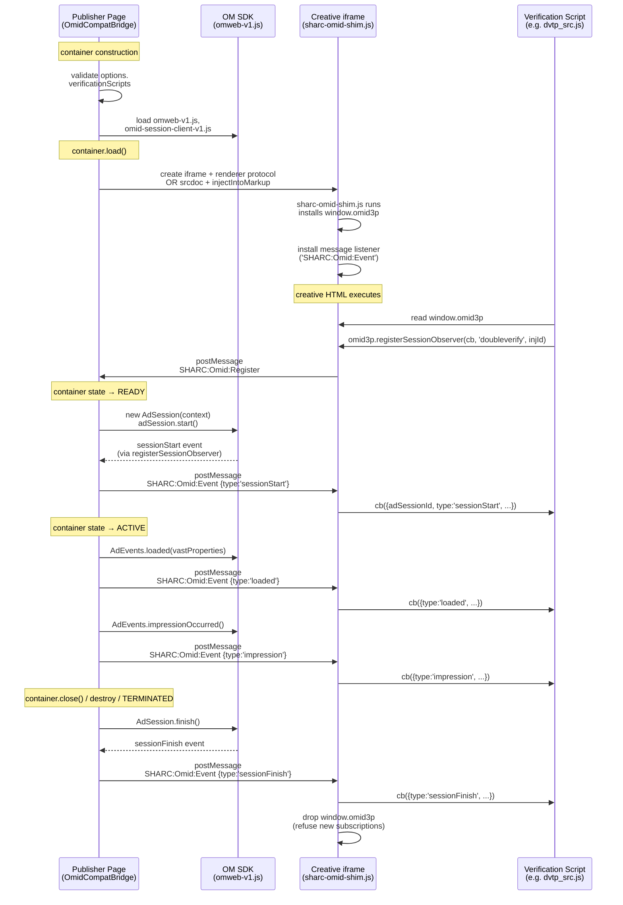

# 0.7.8 — OMID Spec-Compliant Bridge (`window.omid3p` Exposure)

**Status:** Parked draft — awaiting 0.7.7 SHARC Protocol Router primitive (#219). This doc was first written as a 0.7.7 single-release design; review surfaced the need for a cross-frame protocol router (S1, cross-channel envelope-type collision). Router extracted to 0.7.7 (#219); OMID consumes it here in 0.7.8.
**Target version:** 0.7.8
**Issue:** [#217](https://github.com/jeffreycarlson/SHARC/issues/217)
**Prerequisite:** [#219](https://github.com/jeffreycarlson/SHARC/issues/219) — `SHARCProtocolRouter` primitive + renderer protocol retrofit, target 0.7.7. Must land first; this design consumes the router pattern.
**Predecessors:** 0.7.3 (`docs/design/0.7.3-omid-wiring.md` — container-owned OMID lifecycle, decisions D7 and D17 explicitly removed the creative-side OMID API). 0.7.4 (`docs/design/0.7.4-omid-hardening.md` — `feature_load_failed` plumbing, baseUrl validation). 0.7.6 (sidecar `omidAutoInstall` auto-install path for declared OMID bids). 0.7.7 (`docs/design/0.7.7-cross-frame-protocol-router.md` — protocol registry, lifecycle-phase envelope gating).
**Related research:** `docs/research/OM-sdk-research.md`. `docs/research/SHARC-origin-context.md` § renderer trust boundary.
**Existing bridge:** `src/sharc-omid-bridge.js` (`OmidCompatBridge` — current container-owned-only model; no `window.omid3p` exposure).
**Reference implementations cited:** IAB Open-Measurement-JSClients `verification-client.js` (`getThirdPartyOmid()` and `VerificationClient` constructor). IAB OMID API v1.5 PDF. IAB OMID Web Implementation Guide v1.0. IAB AdCOM `OpenRTB support for OMSDK`.

---

## Table of Contents

1. [Problem Statement](#1-problem-statement)
2. [Architecture Overview](#2-architecture-overview)
3. [Transport Mechanism (the load-bearing decision)](#3-transport-mechanism)
4. [Exposure Timing](#4-exposure-timing)
5. [`omid3p` Surface Contract](#5-omid3p-surface-contract)
6. [Event Flow](#6-event-flow)
7. [Security and Trust Boundary](#7-security-and-trust-boundary)
8. [`options.verificationScripts` Repositioning](#8-optionsverificationscripts-repositioning)
9. [Test Strategy](#9-test-strategy)
10. [Migration Plan (0.7.6 → 0.7.7)](#10-migration-plan)
11. [Implementation Plan](#11-implementation-plan)
12. [Decision Log](#12-decision-log)

---

## 1. Problem Statement

0.7.3 locked OMID as a **container-only** measurement extension (D7 / D17): no creative-side API, no `window.omid3p` in the creative iframe. That decision matched the OM SDK Service Script / Session Client roles correctly for the **publisher-page side** of the integration but assumed the creative iframe would never host an OMID-aware verification script.

Three empirically-verified observations invalidate that assumption (see issue #217 evidence trail):

1. **SHARC's current `OmidCompatBridge` exposes no `window.omid3p` anywhere.** `grep -rn "omid3p" src/` returns zero results in the production tree. `injectScripts(html)` and `injectIntoMarkup(html)` are explicit no-ops.

2. **The IAB OMID JS Verification Client expects `window.omid3p` in the same frame as the verification script.** The canonical detection code (`getThirdPartyOmid()` in IAB `Open-Measurement-JSClients` master at `src/verification-client/verification-client.js`) reads `omidGlobal['omid3p']` from the resolved global context — it does **not** walk the frame tree, does **not** look at `window.parent` or `window.top`, and accepts only an object exposing two functions: `registerSessionObserver` and `addEventListener`. Verification scripts loaded inline in the creative iframe see no `omid3p` under SHARC today and fall back to non-OMID measurement modes.

3. **The corpus shows ~24% of API-7-declared bids (101 of 422 across 15 raw files) ship OMID-aware verification vendor scripts inline in the `adm`.** Verified that DoubleVerify's `cdn.doubleverify.com/dvtp_src.js` probes `t.omid3p` for `registerSessionObserver` capability, looks for `omweb-v1.js` in DOM, and accesses `omidVerificationProperties` — the canonical OMID JS Verification Client detection pattern.

Separately, `OmidCompatBridge.options.verificationScripts` is a SHARC-invented config-time injection convention with **no IAB AdCOM/OpenRTB precedent for Banner or Video** (the AdCOM `OpenRTB support for OMSDK` doc, verified against the canonical IAB source, defines a sidecar verification-script path only for Native via `eventtrackers` with `event=555`). The path is still useful — publishers and wrappers do want to inject vendor scripts a creative did not bring inline — but it has been positioned as the **canonical** delivery channel for HTML, and that framing is wrong.

The scope of this design is the redesign of the bridge to align with the IAB spec model: inline-loaded verification scripts find `window.omid3p` in the creative frame and register session observers; publisher-injected verification scripts remain available as a supplementary path that becomes canonical when SHARC adds Native (`eventtrackers` event=555) and VAST (`<AdVerifications>`) support in future releases.

---

## 2. Architecture Overview

### 2.1 Two-frame model — what runs where

```
┌────────────────────────────────────────────────────────────────────────────┐
│  Publisher Page (top window, container origin)                              │
│                                                                             │
│  ┌──────────────────────────────┐    ┌──────────────────────────────┐     │
│  │ OM SDK Service Script        │    │ SHARCContainer                │     │
│  │ (omweb-v1.js)                │    │  + OmidCompatBridge           │     │
│  │ → window.OmidSessionClient   │    │    - owns AdSession lifecycle │     │
│  └──────────────┬───────────────┘    │    - relays events to iframe  │     │
│                 │                    └──────────────┬────────────────┘     │
│                 │ OMID Session messages             │ postMessage / nonced │
│                 ▼                                   ▼ MessageChannel       │
│ ╔═══════════════════════════════════════════════════════════════════════╗ │
│ ║  Creative iframe (cross-origin renderer / cross-origin sandbox)        ║ │
│ ║                                                                        ║ │
│ ║  ┌──────────────────────────────────────────────────────────────────┐ ║ │
│ ║  │ Loaded BEFORE document.write(creativeHtml) by the renderer       │ ║ │
│ ║  │ (or by the URL-variant SDK in the iframe document head):         │ ║ │
│ ║  │                                                                  │ ║ │
│ ║  │   1. sharc-protocol.js                                          │ ║ │
│ ║  │   2. sharc-creative.js                                          │ ║ │
│ ║  │   3. sharc-omid-shim.js  ◄── NEW in 0.7.7                       │ ║ │
│ ║  │      → installs window.omid3p                                    │ ║ │
│ ║  └──────────────────────────────────────────────────────────────────┘ ║ │
│ ║                                                                        ║ │
│ ║  ┌──────────────────────────────────────────────────────────────────┐ ║ │
│ ║  │ Creative HTML (untrusted)                                        │ ║ │
│ ║  │   <script src="https://cdn.doubleverify.com/dvtp_src.js">        │ ║ │
│ ║  │     → reads window.omid3p                                        │ ║ │
│ ║  │     → omid3p.registerSessionObserver(observer, vendorKey, id)    │ ║ │
│ ║  │     → omid3p.addEventListener('impression', cb, id)              │ ║ │
│ ║  └──────────────────────────────────────────────────────────────────┘ ║ │
│ ╚═══════════════════════════════════════════════════════════════════════╝ │
└────────────────────────────────────────────────────────────────────────────┘
```

### 2.2 What is new in 0.7.7

1. **`src/sharc-omid-shim.js`** — a new iframe-side shim that installs `window.omid3p` with the IAB-spec surface (two methods, plus an internal event delivery channel). Loaded into the creative iframe via the same path as the MRAID and SafeFrame bridges — see § 4.
2. **`OmidCompatBridge` extended on the publisher page** — registers an internal session observer on its own `AdSession`, serializes the events, and relays them across the publisher↔iframe boundary to subscribers registered through the iframe shim.
3. **Transport contract** between publisher-page `OmidCompatBridge` and iframe `sharc-omid-shim.js` — see § 3.
4. **`options.verificationScripts` semantics narrowed** in code-level documentation: same field name, same shape (no breaking change to that field), but documented as supplementary publisher/wrapper/vendor injection. The IAB OM SDK `VerificationScriptResource` array on `Context` still carries these into the OM SDK on the publisher page; the iframe shim does not consume them.

### 2.3 What is unchanged

- Publisher-page OM SDK loading (`omSdkServiceScriptUrl`, `omSdkSessionClientUrl`). 0.7.3 § 3 stands.
- Container-owned `AdSession.start() / loaded() / impressionOccurred() / finish()` lifecycle. 0.7.3 § 4 stands.
- Feature name `com.iabtechlab.sharc.omid` in `supportedFeatures` when both SDK URLs are configured. 0.7.3 § 7 stands.
- `KNOWN_BRIDGE_IDENTIFIERS` is **NOT** extended to include `'omid'`. See § 4.2 — OMID still does not route through the renderer-bridge resolver as an API translation bridge; the shim is loaded via a separate mechanism for the same reason.
- 0.7.6 `omidAutoInstall` sidecar normalization. The bid-metadata path still produces `options.verificationScripts` entries; those become supplementary per § 8.

---

## 3. Transport Mechanism

This is the load-bearing architectural decision. The IAB spec dictates the API surface inside the iframe (`window.omid3p` with `registerSessionObserver` / `addEventListener` — § 5). It does **not** prescribe how a publisher-page-owned `AdSession` reaches that surface when the verification script is inline in a cross-origin creative iframe.

### 3.1 Options considered

| Option | Mechanism | Pros | Cons |
|--------|-----------|------|------|
| **(a) Thin shim + postMessage relay** | SHARC ships a small shim into the iframe that installs `window.omid3p`. Shim subscribers are stored in iframe-local state. The publisher-page `OmidCompatBridge` registers a session observer on its `AdSession`, serializes events, and posts them across an origin-pinned, nonce-validated channel. | Minimal code in iframe. Matches MRAID/SafeFrame bridge precedent (thin iframe-side adapter over an out-of-band transport). Single SDK install on the publisher page. No second OM SDK Service Script load. | Requires SHARC to define and own the postMessage envelope. Event surface in iframe is decoupled from OM SDK Session Client internals — SHARC must keep the shim's event types aligned with the OMID event vocabulary. |
| **(b) Load OM SDK Service Script inside the creative iframe too** | Inject `omweb-v1.js` into the creative iframe before creative HTML. Verification Client finds `omid3p` via the in-iframe Service Script's communication primitives. Publisher-page Service Script and iframe Service Script bridge over postMessage internally. | Reuses OM SDK's own cross-frame communication machinery. SHARC writes less event-vocabulary code. | Double OM SDK load (~150KB gzipped per frame). Verification scripts must ship a compatible Service Script implementation — but the canonical `omid3p` is set up by the integration partner's container, not by a second Service Script inside the iframe. Behavior depends on whichever OM SDK Service Script version the publisher loads — not stable across vendor builds. Architecturally **wrong**: per the IAB JS Clients design, the Service Script is the integration partner's responsibility (one per measurement context), not a per-iframe asset. |
| **(c) Use OMID JS Communication primitives (`startVerificationServiceCommunication` path)** | Skip `window.omid3p` entirely. Instead, prearrange the iframe's parent reference so that the Verification Client's first detection path (`startVerificationServiceCommunication(resolveGlobalContext())`) finds an OMID-aware parent and falls into the postMessage protocol. | Closest to IAB's own cross-frame intent. | The Verification Client's first detection path is for verification scripts that the **OM SDK Service Script itself** injected into a verification iframe — not for verification scripts the creative author dropped inline in a publisher-side iframe. Repurposing this path requires SHARC to impersonate the OM SDK Service Script's iframe-injection protocol, which is internal to OM SDK and not a stable public surface. Brittle against OM SDK version drift. |

### 3.2 Decision: Option (a) — thin shim + postMessage relay

**Adopt (a).** Rationale:

1. **Matches the MRAID and SafeFrame precedent.** Both bridges are thin iframe-side adapters that translate a stable, narrowly-scoped public API (`window.mraid`, `window.$sf.ext`) into the SHARC container protocol over a SHARC-owned message channel. The 0.7.7 OMID shim mirrors that pattern: a stable two-method public API (`window.omid3p`) over a SHARC-owned message channel. The container team owns one transport, not three.
2. **`window.omid3p` is the contract verification scripts probe.** The IAB JS Clients code (`getThirdPartyOmid()`) reads `omidGlobal['omid3p']` directly. Anything other than installing that property in the iframe's global scope is either an indirection (option b) or a reinterpretation of an OM SDK-internal protocol (option c).
3. **Bounded SHARC ownership of the OMID event vocabulary.** The iframe shim's event surface is a small, well-documented enum (§ 5). SHARC's responsibility is to keep that enum aligned with the IAB OMID event types as the spec evolves. That responsibility is narrow and visible; option (b) hides it inside OM SDK internals where SHARC has no signal on drift.
4. **No double Service Script.** ~150KB gzipped saved per creative load, and one source of truth for OMID state (publisher-page `AdSession`).

**Why (b) is inferior:** double-Service-Script load is rejected on both code-size grounds and architectural grounds — the OMID API v1.5 PDF describes the Service Script as the integration partner's per-measurement-context asset, not a per-frame asset. Loading it inside the creative iframe inverts the trust model: the creative iframe is hostile, and giving it a second OM SDK Service Script gives the creative the same OM SDK API surface as the container.

**Why (c) is inferior:** reuses an OM SDK-internal protocol that is not a public contract. The published `omid3p` window-property surface is the public contract; SHARC implements against the public contract.

### 3.3 Transport envelope

The publisher-page `OmidCompatBridge` and the iframe shim communicate over a dedicated SHARC message type — **not** the renderer protocol channel (which is one-shot, designed for render handshake), and **not** the bridges-field channel (which is for `window.mraid`-style API translation). The OMID transport is a long-lived, ordered event stream from publisher to iframe, plus a request channel from iframe to publisher for observer registration.

Envelope (publisher → iframe):

```javascript
{
  type: 'SHARC:Omid:Event',
  placementSessionId: '<sharc placementSessionId>',
  sharcNonce: '<construction-time nonce>',
  sequence: <monotonic uint32, per session>,
  event: {
    adSessionId: '<string, OM SDK session id>',
    timestamp: <number, ms>,
    type: '<EventType per § 5>',
    data: { /* event-type-specific payload */ }
  }
}
```

Envelope (iframe → publisher):

```javascript
{
  type: 'SHARC:Omid:Register',
  placementSessionId: '<sharc placementSessionId>',
  sharcNonce: '<construction-time nonce>',
  subscription: {
    kind: 'sessionObserver' | 'eventListener',
    vendorKey: <string, optional for sessionObserver, absent for eventListener>,
    eventType: <string, present iff kind === 'eventListener'>,
    injectionId: <string, verification-client injectionId>,
    subscriptionId: <opaque shim-side id used to scope future Unregister envelopes>
  }
}
```

Both envelopes are validated against the same trust anchors as the renderer protocol (§ 7.1): `event.source` is the expected counterpart `contentWindow` (publisher↔iframe), `event.origin` matches the construction-time-recorded origin, the SHARC nonce matches, and the placementSessionId matches. Out-of-envelope messages are silently dropped.

**Open question (decision log D7):** whether `SHARC:Omid:Unregister` is in scope for 0.7.7 or deferred. The IAB Verification Client does not appear to expose an unregister API today, but the spec does not forbid one and a future spec revision may. Recommend in-scope; small additional surface, large debuggability win.

### 3.4 Why a dedicated channel and not the existing protocol port

The SHARC container protocol uses a port handshake (`SHARC:Container:init` / `SHARC:Creative:init`) over a `MessageChannel` established at iframe load. That channel is **scoped to the creative SDK** — `window.SHARC` — and addresses creative-to-container API calls. The OMID shim is not a creative API call: it is publisher-page-to-iframe event broadcast, addressed to verification scripts that have no awareness of the SHARC creative SDK and may run before or after the creative SDK initializes.

Mixing OMID events into the SHARC port would require the iframe shim to be a peer of the creative SDK on the port (race conditions on port readiness), would couple OMID delivery to creative-SDK lifecycle (verification scripts must measure even if the creative SDK fails to init), and would force the shim to participate in the SHARC handshake (extra protocol surface to harden). A dedicated `window.postMessage` channel with the same trust anchors keeps OMID delivery decoupled from the creative-SDK port and aligns with the IAB Verification Client's expectation that `omid3p` is available synchronously when verification scripts execute.

---

## 4. Exposure Timing

### 4.1 Working assumption from the issue

Issue #217 states: "working assumption for `omid3p` exposure timing parallels existing MRAID / SafeFrame / SHARC bridge attachment from the container side." Reviewing the code confirms the analogy holds **on the iframe side** but the container side has no "attachment" step for these bridges — bridges are scripts injected into the iframe before `document.write(creativeHtml)`. The IAB pattern matches this.

### 4.2 Decision: install `window.omid3p` before `document.write(creativeHtml)`

The renderer (Creative Markup variant) loads compatibility bridge modules from `data.bridges` **before** `document.write(creativeHtml)` — see `examples/renderer/index.html` § 4c quoted comment. This is the same install point for `window.mraid` and `window.$sf.ext`. The 0.7.7 OMID shim must also be installed at this point, so the verification script's first synchronous read of `window.omid3p` succeeds.

**However:** `KNOWN_BRIDGE_IDENTIFIERS` is **not** extended to include `'omid'`. The 0.7.3 rationale stands — OMID is not an API translation bridge; the bridges list is reserved for creative-facing compat shims (MRAID, SafeFrame). Instead, the renderer loads `sharc-omid-shim.js` as a separate, OMID-specific install:

- **Creative Markup variant (renderer):** the renderer accepts a new `omid` boolean (or presence of an explicit shim URL) on the `SHARC:Renderer:render` envelope. When set, the renderer loads `sharc-omid-shim.js` from its own same-origin allowlist (same security model as `loadBridgeModule`) **before** `document.write(creativeHtml)`. The shim's auto-install code runs and installs `window.omid3p`, the message-listener for `SHARC:Omid:Event`, and the message-poster for `SHARC:Omid:Register`.
- **Creative URL variant (SHARCContainer fetches the creative HTML, injects extensions):** the OmidCompatBridge's `injectIntoMarkup(html)` — currently a no-op — becomes a real injector that prepends a `<script src="<sharc base>/sharc-omid-shim.js"></script>` before any creative content, but **only when** `omid3p` exposure is enabled by the operator (see § 11.4 — exposure is opt-in via constructor option in 0.7.7).

### 4.3 Why this matches the IAB pattern

The OMID API v1.5 PDF (p.14, integration partner responsibilities) describes the Service Script as the integration partner's responsibility to load. By analogy, the `omid3p` window object — when the verification script and the Service Script live in different frames — is the integration partner's responsibility to install in the verification script's frame. SHARC is the integration partner in the OMID model; SHARC owns the shim install in the creative iframe.

### 4.4 What "before creative HTML executes" means in each variant

| Variant | Install point | Mechanism |
|---------|---------------|-----------|
| Creative Markup (renderer) | Synchronous import of `sharc-omid-shim.js` before `document.write(creativeHtml)` in the renderer's accept-render path | Same as bridges field — `script-src 'self'` CSP, same-origin assertion in JS, dynamic `import()` |
| Creative URL (operator-fetched HTML, srcdoc) | `injectIntoMarkup(html)` prepends `<script src=".../sharc-omid-shim.js"></script>` to the markup before srcdoc assignment | Mirrors existing extension injector contract |
| Creative URL (direct iframe.src — no markup access) | **Not supported in 0.7.7.** OMID `omid3p` exposure requires SHARC to inject a script into the creative's load; if SHARC does not own the markup, it cannot install `omid3p`. Container declares no OMID feature in this variant. | See decision log D11 — opt-in markup injection (`useMarkupInjection: true`) is the prerequisite for OMID `omid3p` exposure in the URL variant |

The third row is a known gap. In the 0.7.3 design, the Creative URL variant without markup injection was the default. 0.7.7 narrows feature advertisement: if `omid3p` exposure is configured AND the container is running the direct-iframe-src URL variant without `useMarkupInjection`, the container logs a warning and does **not** advertise `com.iabtechlab.sharc.omid` in `supportedFeatures`. The publisher-page-owned `AdSession` still runs (for vendor scripts the publisher injects via `verificationScripts`), but inline-in-`adm` vendor scripts get no `omid3p`. This is the honest behavior; opt-in markup injection is the operator's lever.

---

## 5. `omid3p` Surface Contract

### 5.1 Public API (the contract verification scripts depend on)

Verified against IAB `Open-Measurement-JSClients` master at `src/verification-client/verification-client.js`. The `getThirdPartyOmid()` function accepts an object iff it exposes both methods as functions:

```javascript
window.omid3p = {
  /**
   * Register a session-wide observer that receives ALL session events
   * for the active AdSession.
   *
   * @param {function(event)} observer - receives { adSessionId, timestamp, type, data }
   * @param {string=} vendorKey - optional vendor identifier
   * @param {string} injectionId - opaque id supplied by the verification client
   */
  registerSessionObserver: function(observer, vendorKey, injectionId) { ... },

  /**
   * Register a single-event-type listener.
   *
   * @param {string} eventType - one of the IAB OMID event-type strings (§ 5.3)
   * @param {function(event)} listener - receives { adSessionId, timestamp, type, data }
   * @param {string} injectionId - opaque id supplied by the verification client
   */
  addEventListener: function(eventType, listener, injectionId) { ... }
};
```

**Nothing else is on the contract.** SHARC must not expose additional methods on `window.omid3p` for the 0.7.7 release — verification scripts probe these two methods for capability detection (`typeof omid3p['registerSessionObserver'] === 'function' && typeof omid3p['addEventListener'] === 'function'`), and adding extra surface invites coupling to SHARC-specific APIs that will not survive future OMID spec revisions.

### 5.2 Event shape delivered to observers

```javascript
{
  adSessionId: '<string, OM SDK session id from publisher-page AdSession>',
  timestamp:   <number, ms since epoch — publisher-side wall clock>,
  type:        '<string, see § 5.3>',
  data:        { /* event-type-specific payload, may be empty {} */ }
}
```

`adSessionId` is the OM SDK Session Client's session id read off the publisher-page `AdSession` after `start()`. The shim re-uses the same id for every event in the session, matching the OMID spec.

### 5.3 Event types supported in 0.7.7

The IAB OMID event vocabulary is broad. 0.7.7 ships a subset matching what `OmidCompatBridge` already fires on the publisher-page `AdSession`:

| EventType | When fired | Source on publisher page |
|-----------|-----------|--------------------------|
| `sessionStart` | After `AdSession.start()` succeeds | `registerSessionObserver` callback `type==='sessionStart'` |
| `sessionFinish` | After `AdSession.finish()` | `registerSessionObserver` callback `type==='sessionFinish'` |
| `sessionError` | OM SDK reports a session error | `registerSessionObserver` callback `type==='sessionError'` |
| `loaded` | After `AdEvents.loaded(...)` | Synthesized by bridge at the moment `_fireLoaded()` is called |
| `impression` | After `AdEvents.impressionOccurred()` | Synthesized by bridge at `_fireImpression()` |
| `geometryChange` | On viewability/placement change | Synthesized by bridge at `_signalVisibility` / `_handlePlacementChange` |

**Deferred to follow-up issues:** video-specific event types (`start`, `firstQuartile`, `midpoint`, `thirdQuartile`, `complete`, `pause`, `resume`, `bufferStart`, `bufferFinish`, `skipped`, `volumeChange`, `playerStateChange`, `adUserInteraction`) and any later-spec event types. The 0.7.3 design § 8.1 already lists these as future work for `OmidCompatBridge`. The shim mirrors that coverage — adding the IAB JS Clients full event vocabulary is a separate decision.

`addEventListener` accepts any event type string; if the shim has not been wired to fire that type yet, the listener is registered and silently receives nothing. **No `OMID_UNSUPPORTED_EVENT_TYPE` error code is thrown** — verification scripts probe broadly and rely on absence-of-event semantics, not error semantics.

### 5.4 Observer invocation rules

- Observers registered via `registerSessionObserver` receive every event in the active session, in delivery order (matches the IAB OMID spec).
- Listeners registered via `addEventListener(eventType, ...)` receive only events whose `type` matches `eventType`.
- If a verification script registers an observer **after** `sessionStart` has fired, the shim replays the most recent `sessionStart` event to that observer synchronously, then continues forwarding live events. This matches the spec intent that observers see a coherent session timeline regardless of registration order.
- `loaded` and `impression` are session-singletons (already guarded by `OmidCompatBridge._fireLoaded`/`_fireImpression`). A late-arriving observer sees the replayed `sessionStart` plus any subsequent events, including the already-fired `loaded` / `impression` if those have happened.

**Open question (decision log D8):** the replay-to-late-registrants policy is a judgment call beyond the spec's letter. The spec describes the API but not the ordering guarantee for late-registered observers. Recommend the replay policy as the durable default; surfaces a Jeffrey-decision flag in the log.

### 5.5 Out-of-session calls

If the verification script calls `registerSessionObserver` or `addEventListener` before `OmidCompatBridge` has created its `AdSession` (publisher-page OM SDK still loading), the shim queues the subscription and applies it once the publisher-page bridge sends its first event (typically `sessionStart`). Queued subscriptions are bounded — see § 7.4 on DoS resistance.

---

## 6. Event Flow

### 6.1 End-to-end sequence (Mermaid)



### 6.2 Where the publisher-page bridge taps into OM SDK

`OmidCompatBridge._createSession()` already calls `self._omid.adSession.registerSessionObserver(function (sessionEvent) { ... })` (sharc-omid-bridge.js L865-871). 0.7.7 extends that observer to:

1. On every event from OM SDK, build the SHARC envelope (§ 3.3) and post it to the iframe's `contentWindow` via `iframe.contentWindow.postMessage(envelope, '<recorded iframe origin>')`.
2. Track the iframe origin captured at iframe creation — same value as `this._rendererOrigin` for the Markup variant; for the URL variant with `useMarkupInjection`, the iframe is srcdoc and its origin is `null` / the parent origin (browser-dependent — see § 7.5).
3. Continue the existing `sessionFinish` → `_resetSessionRefs(true)` cleanup, plus a final teardown envelope to the iframe.

For `loaded` / `impression` / `geometryChange` — events synthesized by `OmidCompatBridge` rather than emitted by OM SDK Session Observer — the bridge posts the envelope at the same call sites where it currently calls `_fireLoaded` / `_fireImpression` / `_signalVisibility`.

### 6.3 What about events from verification scripts back to the container

The IAB `omid3p` surface is **observer-only**. Verification scripts subscribe; they do not emit. There is no `omid3p.publishEvent()` or similar — vendor measurement signals flow vendor-script → vendor-CDN over the verification script's own HTTP fetch path, not back through `omid3p`. This means the SHARC transport is **unidirectional** for events (publisher → iframe) and bidirectional only for the registration handshake. 0.7.7 does not need to design a vendor-script-to-container event flow.

---

## 7. Security and Trust Boundary

The creative iframe is hostile. Installing `window.omid3p` in that frame creates a new SHARC-controlled surface that hostile creative code can touch. This section enumerates the surface and the mitigations.

### 7.1 Trust anchors for the transport channel

The publisher → iframe `SHARC:Omid:Event` envelope and the iframe → publisher `SHARC:Omid:Register` envelope are validated against the same anchor set as the renderer protocol (`sharc-container.js _isValidRendererEnvelope`):

- `event.source` is the expected counterpart `contentWindow` (publisher-side validates against `this._iframe.contentWindow`; iframe-side validates against `window.parent`).
- `event.origin` matches the construction-time-recorded origin (publisher-side: `this._rendererOrigin`; iframe-side: the origin recorded from `SHARC:Container:init`).
- `event.data` is a non-null object with a string `type`.
- `event.data.sharcNonce === <construction-time nonce>` — the CSPRNG nonce defends against neighbor-frame forgery. Any frame on the page can postMessage to the publisher window; only the frame the container constructed knows the nonce.
- `event.data.placementSessionId === this.placementSessionId` — defends against cross-session bleed in pages that host multiple SHARC containers.

Envelope-mismatch messages are **silently dropped** (matches the renderer-protocol policy at `_isValidRendererEnvelope`).

### 7.2 Threat: creative registers false session observers and intercepts verification data

The creative iframe is hostile; the verification script inside the creative iframe may also be hostile-aligned (the creative author chose which verification scripts to inline). Hostile creative code can register a session observer of its own and receive every `sessionStart` / `loaded` / `impression` event SHARC delivers.

**Mitigation:** none possible at the OMID layer — by spec, `window.omid3p` events are visible to any code in the verification script's frame. The OMID spec accepts this; the threat model assumes verification scripts are trusted, and the **creative author chose them**.

What SHARC must NOT do: include any sensitive publisher data in the `data` field beyond what OM SDK itself would deliver. The `data` payload mirrors what OM SDK delivers to verification scripts in a same-frame OMID integration. If the creative chooses to inline a verification script, the creative chose to allow that verification script to see those events.

**What this rules out:** SHARC must not extend the OMID event vocabulary with SHARC-specific or publisher-page-specific data. The shim is a faithful relay, not an information channel. Decision log D5 locks this.

### 7.3 Threat: creative spams observer callbacks to cause amplification

A hostile creative could register thousands of observers / listeners, then trigger a high-frequency event (`geometryChange` on resize churn) to cause `O(observers × events)` callback invocations and OOM the iframe.

**Mitigation:**
- The shim caps total subscriptions per iframe at **64** (`MAX_OMID_SUBSCRIPTIONS`). Further `registerSessionObserver` / `addEventListener` calls past the cap are accepted silently (no error to the caller) but ignored — same surface as a vendor SDK that decides to ignore the registration internally.
- The shim caps queued events delivered to a late registrant via the replay path at **1** (only the most recent `sessionStart` is replayed) — does not replay the full event history.
- The publisher-page bridge rate-limits `geometryChange` to at most one event per 100ms (matches OM SDK behavior; OM SDK Service Script throttles geometry events internally).

Decision log D6 locks the cap values; they are deliberately conservative.

### 7.4 Threat: creative spams `SHARC:Omid:Register` envelopes to DoS the publisher window

The iframe-side message-poster targets `window.parent`. A hostile creative could postMessage `SHARC:Omid:Register` envelopes at arbitrary rate to consume publisher-side CPU on envelope validation.

**Mitigation:**
- The publisher-side message handler is `MAX_OMID_REGISTRATIONS_PER_SESSION = 64` envelope-bounded (matches the shim cap — symmetric).
- Beyond the cap, the publisher logs once and starts silently dropping. No `feature_load_failed` is emitted (this is creative-side malice, not feature-load failure).
- Postmessage handlers are cheap (envelope validation is O(1)); the cap is defense-in-depth.

### 7.5 Threat: srcdoc iframe with `null` origin breaks origin validation

For the Creative URL variant with `useMarkupInjection: true`, the iframe is loaded via `srcdoc`. In Chromium, srcdoc iframes inherit the parent origin; in Safari and some other browsers, srcdoc iframes have `null` origin or an opaque origin. The publisher-page bridge cannot validate `event.origin === this._iframeOrigin` reliably across browsers.

**Mitigation:** for srcdoc / opaque-origin iframes, the publisher-side envelope validator additionally checks `event.source === this._iframe.contentWindow` (the contentWindow reference defends against the frame being a different one — even if origin is opaque). The SHARC nonce check provides the second-layer defense. Origin check is best-effort: pass if origin is non-null and matches; pass if origin is `null` and `event.source` matches `contentWindow`; fail otherwise. Decision log D9 locks the policy; it parallels the existing `_isValidRendererEnvelope` for opaque-origin renderer iframes (future work — currently the renderer protocol is documented for cross-origin renderer URLs only).

### 7.6 Trust model summary

| Direction | Trust anchor | Failure mode |
|-----------|--------------|--------------|
| Publisher → Iframe (`SHARC:Omid:Event`) | nonce + placementSessionId + origin + source | Silent drop on iframe side; envelope mismatch invisible to creative |
| Iframe → Publisher (`SHARC:Omid:Register`) | nonce + placementSessionId + origin + source + subscription cap | Silent drop on publisher side past cap; logged once |
| Iframe→creative-iframe observer invocation | trust model assumes creative-chosen verification scripts are trusted | Out of scope — IAB OMID spec assumption |

Hardening checklist for the implementation phase (Code Reviewer + Security Engineer pass):

- [ ] Envelope validator parity with `_isValidRendererEnvelope`
- [ ] `MAX_OMID_SUBSCRIPTIONS` cap enforced on both sides
- [ ] Nonce reuse: confirm `_sharcNonce` is acceptable to reuse across renderer protocol and OMID transport (it is, per renderer protocol design — single nonce, single iframe, lifetime-bounded)
- [ ] Subscription registration handshake never echoes the SHARC nonce back to the iframe in any response (one-way — publisher does not respond to register envelopes, just adds the subscription)
- [ ] Logging discipline: no envelope payload contents in logs (only counts and rejection reasons)

---

## 8. `options.verificationScripts` Repositioning

### 8.1 Same shape, narrowed semantics

The locked decision (issue #217): the field stays. Its shape stays. Its semantics narrow — it is no longer the canonical OMID delivery channel for HTML; it is **supplementary publisher / wrapper / vendor injection**.

Concretely:

| Aspect | Before (0.7.6) | After (0.7.7) |
|--------|----------------|---------------|
| Field name | `OmidCompatBridge.options.verificationScripts` | unchanged |
| Field shape | `Array<{ url \| resourceUrl, vendor, accessMode, verificationParameters }>` | unchanged |
| Behavior on publisher page | Passed to `Context(partner, verificationScripts)` so OM SDK Service Script injects them into the `OmidVerificationProperties` it provides to verification scripts running in its own measurement iframe | unchanged |
| Behavior in creative iframe | (None — `injectIntoMarkup` is a no-op) | Still none — the shim does not consume `options.verificationScripts` |
| Doc framing | "canonical OMID delivery channel for verification scripts" | "supplementary path for publisher- / wrapper- / vendor-injected verification scripts. The canonical OMID delivery channel for HTML adm is `window.omid3p` exposure in the creative iframe (§ 5). This path becomes canonical when SHARC adds Native (eventtrackers event=555) and VAST (`<AdVerifications>`) creative formats — until then, it remains useful for publishers / wrappers / vendors that want to inject verification scripts beyond what the creative ships inline." |

### 8.2 Duplicate-registration concern

A creative may ship an inline `<script src="dvtp_src.js">`. The same publisher may also pass `{ url: 'https://cdn.doubleverify.com/dvtp_src.js', vendor: 'doubleverify' }` in `options.verificationScripts`. Both paths reach OM SDK, but via different mechanisms:

- Inline script registers via `omid3p.registerSessionObserver` (iframe shim).
- Publisher-injected script reaches OM SDK Service Script via `OmidVerificationProperties` and runs in OM SDK's own measurement context (publisher page side).

These are two separate executions of the same vendor script in two separate measurement contexts. The IAB OMID model accepts this — each measurement context is its own session view. SHARC does not deduplicate (cannot — the publisher-injected version runs in a different frame).

**What 0.7.7 does NOT add:** no detection of duplicate registration, no warning, no `throwOmidConfigError`. The publisher-injected and inline paths are independent by design.

### 8.3 No field rename, no deprecation

Per the locked decision and pre-1.0 convention: same field name, no alias, no warning, no migration period. The field's shape and validation rules (`validateVerificationScripts`) stay unchanged. The behavioral narrowing is documentation-only.

---

## 9. Test Strategy

### 9.1 Two-layer model

Per issue #217 lock:

- **Layer 1 (unit/CI):** stub OMID Verification Client embedded in a synthetic HTML creative. Asserts `omid3p` is present, observer registration succeeds, `sessionStart` / `loaded` / `impression` callbacks fire.
- **Layer 2 (integration follow-up):** validator loads real vendor scripts (DV, IAS, Moat) against the corpus. Out of scope for 0.7.7 — separate follow-up issue.

### 9.2 Layer 1 — stub Verification Client

```javascript
// test/browser/test-omid-shim-fixture.html (new)
//
// Loaded by the renderer (or via srcdoc in the URL+markup variant). Container
// loads OmidCompatBridge with stub omSdkServiceScriptUrl / omSdkSessionClientUrl
// pointing to a same-origin stub Service Script that exposes a minimal
// OmidSessionClient namespace sufficient for AdSession construction.
//
// Inline in the creative HTML:
//   <script>
//     // Inline OMID Verification Client stub — mirrors the IAB
//     // verification-client.js detection pattern.
//     (function () {
//       var omid3p = window.omid3p;
//       window.__capturedOmidEvents = [];
//       if (omid3p &&
//           typeof omid3p.registerSessionObserver === 'function' &&
//           typeof omid3p.addEventListener === 'function') {
//         omid3p.registerSessionObserver(function (event) {
//           window.__capturedOmidEvents.push({
//             type: event.type,
//             adSessionId: event.adSessionId,
//             timestamp: event.timestamp,
//             dataKeys: Object.keys(event.data || {})
//           });
//         }, 'sharc-test-vendor', 'stub-injection-id');
//       } else {
//         window.__capturedOmidEvents.push({ type: '__no_omid3p__' });
//       }
//     }());
//   </script>
```

Harness assertions (Puppeteer-driven, in the existing `test/browser/` pattern):

| Assertion | Expected |
|-----------|----------|
| `window.__capturedOmidEvents` contains a `'sessionStart'` entry after container reaches READY | true |
| `'loaded'` follows `'sessionStart'` after container reaches ACTIVE | true |
| `'impression'` follows `'loaded'` | true |
| `'sessionFinish'` after container.close() | true |
| No `'__no_omid3p__'` entry | true |
| `'impression'` appears at most once | true |
| `window.omid3p` is `undefined` after `'sessionFinish'` | true (§ 6.1 final step) |

The stub Service Script and the stub Session Client are minimal: they implement only the API surface the existing `OmidCompatBridge._createSession()` touches (`Partner`, `Context`, `AdSession.start()`, `AdSession.registerSessionObserver`, `AdEvents.loaded()`, `AdEvents.impressionOccurred()`, `AdSession.finish()`). Lives under `test/browser/stubs/omid-service-stub.js` and `test/browser/stubs/omid-session-client-stub.js`.

### 9.3 Layer 1 — additional bridge-only unit tests

| Test | Description |
|------|-------------|
| Shim install in clean iframe context exposes `window.omid3p` with two functions | jsdom |
| Shim queues subscriptions registered before publisher-side `sessionStart` | jsdom |
| Shim replays the last `sessionStart` to a late-registered observer | jsdom |
| Shim caps subscriptions at `MAX_OMID_SUBSCRIPTIONS` | jsdom |
| Publisher-side bridge rejects `SHARC:Omid:Register` envelopes with bad nonce | jsdom + mock postMessage |
| Publisher-side bridge rejects envelopes with bad placementSessionId | jsdom + mock postMessage |
| Publisher-side bridge rejects envelopes with bad source | jsdom + mock postMessage |
| Publisher-side bridge forwards `sessionStart` / `loaded` / `impression` / `sessionFinish` from OM SDK observer to the iframe | jsdom + stub OM SDK |

### 9.4 Layer 2 — validator integration (out of scope)

Separate follow-up issue. Validator loads real DV / IAS / Moat scripts against the corpus and asserts OMID detection. The 0.7.7 design does not block on this.

### 9.5 Coverage gates

- `npm run test` (jsdom suite) must pass with the new shim tests.
- `npm run test:browser` (Puppeteer suite, when wired up — depends on 0.7.6 test infra) must pass with the new fixture.
- Existing `OmidCompatBridge` tests under `test/` continue to pass — no regressions on the publisher-page lifecycle.

---

## 10. Migration Plan

### 10.1 Pre-1.0 clean break

Per `feedback_pre_1_breaking_changes` and SHARC project convention: no deprecation period, no aliases, no migration warnings. Breaking changes ship clean in 0.7.7.

### 10.2 Behavior matrix

| Caller / configuration | 0.7.6 behavior | 0.7.7 behavior | Breaking? |
|------------------------|----------------|----------------|-----------|
| `new OmidCompatBridge({ omSdkServiceScriptUrl, omSdkSessionClientUrl, verificationScripts: [...] })`, default options | OM SDK loaded on publisher page; container-only OMID lifecycle; no `window.omid3p` in creative iframe | OM SDK loaded on publisher page; container-only OMID lifecycle; **plus** `window.omid3p` exposed in creative iframe iff variant supports it (§ 4.4) | Yes — new surface in creative iframe. Creative content that previously could not depend on `window.omid3p` may now see it; collisions with anything else the creative installed at `window.omid3p` will fail loudly (§ 10.3). |
| Same as above, Creative URL variant without `useMarkupInjection` | Same | OM SDK loaded; container OMID lifecycle runs; but `getFeatureName()` returns `null` because the shim cannot be installed in the iframe. `com.iabtechlab.sharc.omid` is NOT advertised in `supportedFeatures`. | Yes — feature now conditional on iframe-shim-installable variant. |
| `injectScripts(html)` callers | Returned `html` unchanged (no-op) | Returns `html` unchanged when shim-install is not configured; returns `html` with prepended `<script src=".../sharc-omid-shim.js"></script>` when shim-install is configured AND the variant requires it | Yes — `injectScripts` is no longer a strict identity function. |
| `injectIntoMarkup(html)` callers | Returned `html` unchanged | Same as `injectScripts` above (same install point) | Yes — same as above. |
| Operators reading `options.verificationScripts` to drive validation pipeline | Field carries OMID delivery URLs | Same field, same shape; docs reframe its role | No code break, doc-only |

### 10.3 Throw-on-legacy enforcement

The 0.7.3 lock declared the creative-side OMID API path removed (D7, D17). 0.7.7 reverses that lock with a different mechanism: not a `SHARC:Creative:requestOmid` message type (that path stays removed), but a `window.omid3p` install. **Throwing on legacy:**

- Any caller that depends on `OmidCompatBridge.injectScripts(html) === html` as a strict identity invariant will silently get the same identity behavior in 0.7.7 IF the shim is not configured. The break only manifests when shim install is enabled. The change is observable but does not require throws.
- Any caller that depends on `window.omid3p` being absent in the creative iframe will see it present. **If** the creative attempted to install its own `window.omid3p`, the shim throws synchronously at install time:

```javascript
// In sharc-omid-shim.js
if (window.omid3p) {
  throw new Error(
    '[SHARC OMID Shim] window.omid3p is already installed. ' +
    'SHARC manages omid3p exposure; nested or duplicate installations are not supported.'
  );
}
```

This is the throw-on-legacy enforcement: it surfaces collisions immediately rather than silently winning a race. Decision log D10 locks this.

### 10.4 CHANGELOG entry (proposed)

```markdown
## [0.7.7] — 2026-MM-DD

### Added
- `OmidCompatBridge` now exposes `window.omid3p` to the creative iframe
  per IAB OMID API v1.5, enabling OMID-aware verification scripts that
  arrive inline in `adm` (DoubleVerify, IAS, Moat, Integral) to detect
  SHARC's OMID integration and register session observers. Container-
  owned OM SDK lifecycle (0.7.3) is unchanged — the publisher-page
  `AdSession` is the single source of truth; the iframe shim is a
  one-way relay of session events to inline verification scripts.
- New `sharc-omid-shim.js` artifact, loaded into the creative iframe
  by the renderer (Creative Markup variant) or by `injectIntoMarkup`
  (Creative URL + `useMarkupInjection`). Exposes only the two
  IAB-required methods: `registerSessionObserver` and `addEventListener`.

### Changed
- `OmidCompatBridge.options.verificationScripts` semantics narrowed:
  now positioned as a **supplementary** publisher / wrapper / vendor
  injection path, no longer the canonical OMID delivery channel for
  HTML. The field name and shape are unchanged. This path will
  become canonical when SHARC adds Native (eventtrackers event=555)
  and VAST (`<AdVerifications>`) creative formats.

### Breaking
- Containers configured with `OmidCompatBridge` and running the
  Creative URL variant **without** `useMarkupInjection` no longer
  advertise `com.iabtechlab.sharc.omid` in `supportedFeatures`. The
  publisher-page `AdSession` still runs for `options.verificationScripts`
  entries, but inline `omid3p`-probing verification scripts will not
  find `omid3p`. Operators that depend on OMID feature advertisement
  in this variant must enable `useMarkupInjection: true`.
- Creatives that installed their own `window.omid3p` previously
  (a no-op under 0.7.6 because SHARC did not install one) now throw
  at SHARC shim install time. No deprecation period — pre-1.0
  convention.
```

---

## 11. Implementation Plan

### 11.1 New files

| File | Purpose | Approximate size |
|------|---------|------------------|
| `src/sharc-omid-shim.js` | Iframe-side shim: installs `window.omid3p`, transport listener, subscription registry | 250 LOC |
| `test/browser/stubs/omid-service-stub.js` | Minimal stub OM SDK Service Script for tests | 80 LOC |
| `test/browser/stubs/omid-session-client-stub.js` | Minimal stub OM SDK Session Client | 100 LOC |
| `test/browser/test-omid-shim-fixture.html` | Synthetic creative with inline Verification Client stub | 60 LOC |
| `test/browser/test-omid-shim-puppeteer.js` | Puppeteer harness for the fixture | 200 LOC |
| `test/node/test-omid-shim.js` | jsdom unit tests for the shim | 300 LOC |
| `test/node/test-omid-bridge-relay.js` | jsdom tests for publisher-side relay | 300 LOC |

### 11.2 Modified files

| File | Change |
|------|--------|
| `src/sharc-omid-bridge.js` | Extend session observer to relay events to iframe via `iframe.contentWindow.postMessage`. Replace `injectScripts` / `injectIntoMarkup` no-ops with shim-injection logic when the new opt-in option is set. Track iframe origin / nonce alongside existing references. |
| `src/sharc-container.js` | Pass-through: publisher-page bridge needs the iframe reference (already has it via `_container._iframe`) and the SHARC nonce. No bridges-field changes. |
| `examples/renderer/index.html` | Add `omid` boolean accept path on `SHARC:Renderer:render` envelope. Load `sharc-omid-shim.js` from the same same-origin allowlist as the existing bridge modules. |
| `rollup.config.js` | Add `sharc-omid-shim.js` as a build entry, output to `dist/` alongside the other bridge bundles. |
| `package.json` | Add `npm run test:omid-shim` script. |
| `docs/api-reference.md` (if present) or in-source JSDoc | Document the new `omid3p` surface and the option that controls shim install. |
| `CHANGELOG.md` | Entry per § 10.4. |

### 11.3 Constructor option for opt-in shim install

```javascript
new OmidCompatBridge({
  omSdkServiceScriptUrl: '...',
  omSdkSessionClientUrl: '...',
  verificationScripts: [...],  // supplementary, per § 8
  exposeOmid3p: true,           // NEW in 0.7.7 — install window.omid3p shim
                                // in the creative iframe. Default: true.
});
```

Default `true` because the whole point of 0.7.7 is to match the IAB spec. Operators that explicitly do not want the shim (e.g. legacy integrations that conflict) set `exposeOmid3p: false` and get 0.7.3 behavior.

**Open question (decision log D2):** the default. Arguably defaults to `false` for a 0.7.x minor bump to minimize blast radius. Recommend `true` because (a) the spec-compliant behavior is the intended behavior, and (b) any conflict is loud-fail at shim install (§ 10.3) not silent-corrupt.

### 11.4 Implementation step ordering

| Step | Description | Estimate |
|------|-------------|----------|
| 1 | Implement `sharc-omid-shim.js` standalone (no transport — just the API surface and subscription registry) | 3 hours |
| 2 | Implement transport receiver in shim (`SHARC:Omid:Event` listener) and message poster (`SHARC:Omid:Register`) | 2 hours |
| 3 | Extend `OmidCompatBridge` session observer to post `SHARC:Omid:Event` envelopes; add `SHARC:Omid:Register` envelope handler | 3 hours |
| 4 | Implement shim install via `injectScripts` / `injectIntoMarkup` for URL+markup variant | 1 hour |
| 5 | Extend renderer to accept `omid` flag and load shim before `document.write` | 2 hours |
| 6 | Write Layer 1 unit tests (jsdom) per § 9.3 | 4 hours |
| 7 | Write Layer 1 fixture and Puppeteer harness per § 9.2 | 4 hours |
| 8 | Update CHANGELOG, in-source JSDoc, narrow `options.verificationScripts` framing per § 8 | 1 hour |
| 9 | Code Reviewer + Security Engineer pass | 2 hours |

**Total estimate:** ~22 hours (3–4 working days).

---

## 12. Decision Log

| ID | Decision | Status | Rationale |
|----|----------|--------|-----------|
| **D1** | Transport mechanism: option (a) thin shim + postMessage relay | ✅ Locked | § 3.2. Matches MRAID/SafeFrame precedent, public-contract-stable, no double Service Script. |
| **D2** | Default for `exposeOmid3p` option: `true` | 🟡 Needs Jeffrey input | § 11.3. Argument for `true`: spec-compliance is the intended behavior. Argument for `false`: minimize blast radius for a 0.7.x bump. Architect's recommendation: `true`. |
| **D3** | Exposure timing: before `document.write(creativeHtml)`, same install point as MRAID/SafeFrame bridges | ✅ Locked | § 4.2. Matches verification-client.js synchronous `omid3p` probe. |
| **D4** | `'omid'` stays out of `KNOWN_BRIDGE_IDENTIFIERS`; renderer accepts a separate `omid` flag on `:render` | ✅ Locked | § 4.2. Preserves 0.7.3 architectural distinction — OMID is not API translation. |
| **D5** | `omid3p` event vocabulary is faithful relay of IAB OMID event types; no SHARC-specific extensions | ✅ Locked | § 7.2. Shim is not an information channel; threat model assumes hostile creative can observe events. |
| **D6** | `MAX_OMID_SUBSCRIPTIONS = 64`, `MAX_OMID_REGISTRATIONS_PER_SESSION = 64` | 🟡 Architectural judgment, recommend lock | § 7.3, § 7.4. Conservative caps; no real-world OMID measurement context registers more than a handful of observers. Should be tunable via constructor option. Recommendation: lock at 64 for 0.7.7. |
| **D7** | `SHARC:Omid:Unregister` envelope in scope for 0.7.7 | 🟡 Architectural judgment, recommend in-scope | § 3.3. IAB Verification Client does not expose unregister today, but symmetric API + debuggability win. Recommendation: in-scope. |
| **D8** | Late-registered observers receive a replay of the most recent `sessionStart` event | 🟡 Architectural judgment, recommend lock | § 5.4. Beyond IAB spec letter; aligns with spec intent. Cap of 1 replayed event keeps the surface bounded. |
| **D9** | Origin validation for srcdoc / opaque-origin iframes: best-effort, with `event.source === contentWindow` as the load-bearing check | 🟡 Architectural judgment, security implications | § 7.5. Mirrors how the renderer protocol would handle opaque-origin iframes if it supported them (currently it does not — renderer is always cross-origin). Worth a Security Engineer review pass. |
| **D10** | Throw synchronously at shim install if `window.omid3p` is already defined | ✅ Locked | § 10.3. Pre-1.0 throw-on-legacy convention; surfaces collisions loudly. |
| **D11** | OMID feature not advertised in Creative URL variant without `useMarkupInjection` | ✅ Locked | § 4.4. Honest behavior — SHARC cannot install `omid3p` in a frame whose markup it does not own. Operator's lever to opt in is `useMarkupInjection: true`. |
| **D12** | `options.verificationScripts` field name and shape unchanged; semantics narrowed in doc only | ✅ Locked | Per issue #217 lock. § 8. |
| **D13** | Event types in 0.7.7: `sessionStart`, `sessionFinish`, `sessionError`, `loaded`, `impression`, `geometryChange` (subset matching `OmidCompatBridge` publisher-side coverage) | ✅ Locked | § 5.3. Mirrors 0.7.3 § 8.1 — video event types deferred to follow-up issues. |
| **D14** | Transport over dedicated `window.postMessage` channel, **not** the SHARC `MessageChannel` port | ✅ Locked | § 3.4. Decouples OMID delivery from creative-SDK lifecycle and handshake. |
| **D15** | Iframe shim is unidirectional for events (publisher → iframe); registration handshake is bidirectional | ✅ Locked | § 6.3. IAB `omid3p` surface is observer-only — no `publishEvent` method. |
| **D16** | Validator integration with real DV / IAS / Moat scripts is out of scope for 0.7.7 | ✅ Locked | Per issue #217 lock. Separate follow-up. |
| **D17** | 0.7.3 D7 / D17 reversal: `window.omid3p` IS exposed in the creative iframe in 0.7.7 | ✅ Locked | Per issue #217 lock. The 0.7.3 decision was correct against the SHARC creative API surface but missed the inline-verification-script path. |

### Items requiring Jeffrey's explicit input

| ID | Item | Why it needs Jeffrey |
|----|------|----------------------|
| **D2** | Default for `exposeOmid3p` constructor option (`true` vs `false`) | This is a product decision about default opt-in behavior. Architect recommends `true`; Jeffrey's call on the default given the corpus's 24% OMID-inline rate and the publisher-deployment blast radius. |
| **D6** | Cap values for `MAX_OMID_SUBSCRIPTIONS` / `MAX_OMID_REGISTRATIONS_PER_SESSION` | Architect's judgment (64) is conservative; Jeffrey may have field intelligence on real-world vendor measurement contexts that justifies a different number. |
| **D7** | Scope: `SHARC:Omid:Unregister` envelope in or out for 0.7.7 | Marginal added surface vs. debuggability — Jeffrey's call. |
| **D8** | Replay policy for late-registered observers | Beyond IAB spec letter — Jeffrey's call on whether this is durable behavior we want SHARC to commit to. |
| **D9** | Srcdoc / opaque-origin policy | Security Engineer pass will weigh in but the architectural shape (best-effort origin + load-bearing source check) is a Jeffrey-level call given the trust-boundary implications. |

---

*End of design spec.*
